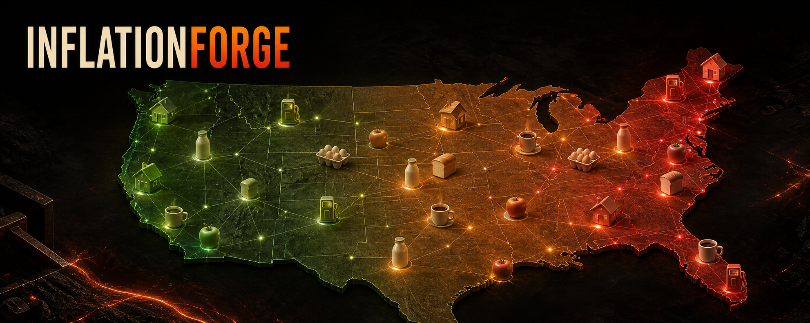
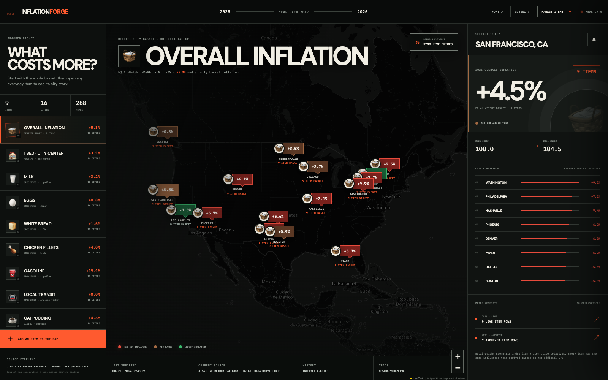

# InflationForge

<p align="center">
  <a href="https://inflationforge.onrender.com"></a>
  <a href="https://github.com/KaushikSiva/Inflation-Forge/actions"></a>
  
</p>



> **The real world changes every day. Your software should know when it does.**

InflationForge is a real, map-first inflation tracker and a **software factory for price intelligence**. It compares last year with this year for the same everyday item in the same city, keeps the source receipts, and lets an operator add the next item to every city without writing or redeploying feature code.

**[Open the live map →](https://inflationforge.onrender.com)**

If you believe public price data should be inspectable instead of mysterious, star the repo and share the map.



## What you can do

- Open **Overall Inflation** to compare a transparent nine-item city basket.
- Switch to rent, milk, eggs, bread, chicken, gas, transit, coffee, or apples.
- Click a city to see this year, last year, its national rank, and both source receipts.
- Read red as the highest city tier, brown as the middle, and green as the lowest for the current lens.
- Open **Manage Items** and promote another discovered source row into the running product.
- Retire or restore an item without erasing historical observations.
- Follow the entire collection in self-hosted SigNoz and catalog its governed state in Port.

There are no generated prices or mocked city comparisons in the product path. Missing evidence produces missing data or an explicitly named fallback—not a plausible-looking number.

## Why this is a factory

Most trackers are hard-coded dashboards. InflationForge treats every tracked item as a governed capability:

```text
DISCOVERED REAL-WORLD SOURCE ROW
                 ↓
ITEM + UNIT NORMALIZATION CONTRACT
                 ↓
DETERMINISTIC VALIDATION
                 ↓
VERSIONED CAPABILITY MANIFEST
                 ↓
COLLECTION ACROSS EVERY CITY
                 ↓
PORT CATALOG + SIGNOZ OBSERVABILITY
```

Adding apples is not a new coding project. The factory validates the live binding, versions it, adds it to the next collection set, exposes it through the same API, and makes it a new map lens. Retirement is soft, so the audit trail remains reproducible.

## Overall Inflation, without a black box

The Overall tab is a derived equal-weight geometric price index. For each city, InflationForge computes every active item’s price relative (`this year / last year`) and takes their geometric mean. Using relatives prevents a high-dollar category such as rent from numerically overwhelming milk or bread.

The UI labels this clearly: **it is not official CPI**. It is an inspectable basket of sourced observations, designed for city-to-city exploration.

## Sponsor stack

InflationForge was built for the **Zero Downtime hackathon** around three sponsor systems. Each sponsor owns a necessary part of the product rather than appearing as a logo-only integration.

| Sponsor | What it does in InflationForge |
|---|---|
| **Bright Data** | Discovers and validates the current public city-price surface through the SERP API. The resulting pages become normalized item observations. If the API or publisher rejects a request, the source mode and trace explicitly identify the live-reader fallback. |
| **SigNoz** | The self-hosted observability plane. OTLP/HTTP traces, structured logs, and metrics show discovery, current-page fetches, archive cache hits, normalization, persistence, Port sync, durations, failures, and trace/log correlation. |
| **Port** | The control plane and software catalog. Port blueprints model tracked capabilities, price snapshots, and city comparisons; actions govern add, retire, restore, and sync operations. Failed tenant writes are persisted to an explicitly labeled local event log. |

OpenStreetMap + Leaflet provide the geography; they do not provide price data. Internet Archive captures provide the same-season historical evidence.

## Evidence pipeline

```text
Bright Data discovery ─────┐
Live public price pages ───┼──► normalized observations ──► city/item comparisons
Internet Archive history ──┘                 │                         │
                                             ▼                         ▼
                                      SQLite evidence          Overall + item maps
                                             │                         │
                                    ┌────────┴────────┐                │
                                    ▼                 ▼                ▼
                              SigNoz telemetry    Port catalog    source receipts
```

Every observation keeps its URL, timestamps, raw label, raw value, conversion multiplier, normalized USD value, snapshot hash, and trace ID.

## Run locally

Requires Python 3.11+ and internet access.

```bash
git clone https://github.com/KaushikSiva/Inflation-Forge.git
cd Inflation-Forge
cp .env.example .env
make install
make test
make demo
```

Open <http://localhost:8000>. A new installation performs a real collection when no snapshot exists.

For self-hosted SigNoz:

```bash
make signoz-install
make signoz-up
make demo-signoz
```

Then open <http://localhost:8080>, choose Logs or Traces, and filter `service.name = inflationforge`. Self-hosted OTLP ingestion is keyless; an API key is only needed for SigNoz query automation.

## Three-minute demo

1. Open **Overall Inflation** and explain the equal-weight, non-CPI basket.
2. Click San Francisco and Washington to compare index movement and the underlying 18 observations.
3. Switch to milk or rent; the same markers now rank absolute item prices.
4. Open **Manage Items**, bind a discovered source row, and promote it across every city without a code change.
5. Open SigNoz with the displayed trace ID to show correlated `span.*.ok` logs and the end-to-end sync trace.
6. Open Port to show the capability, snapshot, and comparison catalog—or the visible local fallback if tenant permissions reject an upsert.

## API

```text
GET    /health
GET    /api/runtime
GET    /api/dashboard
POST   /api/prices/sync
POST   /api/prices/sync-async
GET    /api/prices/sync-jobs/{id}
GET    /api/snapshots
GET    /api/snapshots/{id}/observations
GET    /api/factory
GET    /api/items
POST   /api/items
DELETE /api/items/{id}
POST   /api/items/{id}/restore
GET    /api/telemetry
```

Operators can bypass the freshness window for an audited release refresh with `POST /api/prices/sync?force=true`.
Port manual and scheduled workflows should call `POST /api/prices/sync-async?force=true`.
That endpoint immediately returns a durable job ID, avoiding webhook deadlines while the
same real collection, telemetry, persistence, and Port publication continue in the background.

The item factory only accepts a source label discovered by the latest real collection:

```bash
curl -sS -X POST http://localhost:8000/api/items \
  -H 'Content-Type: application/json' \
  -d '{
    "name": "Bananas",
    "category": "GROCERIES",
    "unit": "1 lb",
    "source_label": "Banana (1 lb)",
    "conversion_multiplier": 1,
    "owner": "inflation-research"
  }'
```

## Deployment

The repo includes a production `render.yaml`, a health check, cache headers, gzip, deterministic response ETags, sync deduplication, and a Docker image that respects Render’s `$PORT`. Secrets stay in Render environment variables and `.env`; they are never bundled into browser assets.

See [Architecture](docs/ARCHITECTURE.md), [Bright Data](docs/BRIGHT_DATA.md), [SigNoz](docs/SIGNOZ.md), [Port](port/README.md), [scale notes](docs/SCALE.md), and the [demo runbook](docs/DEMO.md).

## Data interpretation

InflationForge shows observed city price-table values, not government statistics and not every transaction in a city. A percentage is the difference between two sourced observations or, in Overall mode, an equal-weight index of those item relatives. Always inspect the receipts before making a consequential decision.

## Contributing

Issues and pull requests are welcome. Start with [CONTRIBUTING.md](CONTRIBUTING.md). Please preserve the project’s central invariant: **never replace missing real evidence with generated data.**

## License

MIT © 2026 Kaushik Sivakumar
