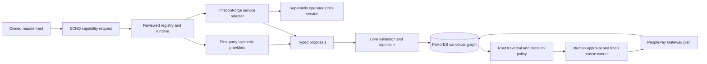

# Open-source extension selection and implementation report

Inspected 2026-10-05. The new brief supplied repository placeholders, not new
external URLs. This report evaluates the four existing bundled projects. No
new upstream repository was cloned, no upstream source was copied into the
extension platform, and no provider deployment was created.

The selection findings below record the intake and the resulting
implementation. Detailed interfaces, source paths, ten fit scores, Git tree
identities and risks are in the [bundled project dossier](extensions/intake/bundled-projects.md).
Future repository intake follows [the development guide](EXTENSION_DEVELOPMENT.md).

## 1. PeoplePay ECHO current architecture

| Component | Actual purpose | Runtime/API | State, input and output | Extension boundary and current limit |
|---|---|---|---|---|
| ECHO API/UI | Requirements, source lineage, evidence review, recommendation trace | Python/FastAPI and static browser UI; `/echo/requirements`, evaluate, trace, invalidate and approve routes | FalkorDB; requirement/evidence inputs, decision and graph trace outputs | Owns canonical graph truth and decision policy; real evidence ingestion is through reviewed proposals. |
| ECHO engine | Explicit dependency traversal, deduplication, temporal/identity/policy checks, robust scoring, root-removal analysis | `echo/engine.py` and core-owned Cypher queries | Source/evidence paths to immutable candidate/decision snapshots | Does not infer hidden copying or statistical independence; raw utility comes from core candidate policy, not an extension's rank. |
| Extension registry/runtime | Reviewed manifests, capability routing, enable/disable, health, timeout/circuit/fallback controls | `/echo/v1/extensions`, `/execute`, `/runs`, administrator enable route | Process settings; run provenance persists through core ingestion | Manifest cannot import executable code; only explicit bootstrap registration attaches adapters. |
| Extension ingestion | Producer validation, owned requirement binding, version/run trace, canonical IDs, unresolved aliases, provenance | `echo/extensions/ingestion.py` | Typed proposals to FalkorDB `ExtensionVersion`, `ExtensionRun`, representations, claims/evidence/source snapshots | Display names do not silently become canonical suppliers. The ingestion lock is local to one process. |
| Identity | Existing PeoplePay caller verification plus separate extension administrator token | `gateway/auth.py` reused by `echo/auth.py` | Caller identity; `ECHO_ADMIN_TOKEN` for administration | OPEN mode still trusts the caller header for local use. Verified JWT mode needs operator configuration. |
| Approval/Gateway | Explicit human confirmation, fresh evidence reassessment, non-executing plan, transaction lineage | ECHO approval calls Gateway `/transactions` and `/{id}/plan` | Gateway SQLite owns transactions; ECHO retains references and approval state | No real payment/provider purchase. Uncertain creation enters reconciliation rather than blind retry. |
| GreenChain | Manufacturer leads and environmental estimates | Python/FastAPI, Next frontend, Dedalus/XGBoost | Own SQLite caches/history, reference data/models | Separate service; extension activation deferred. |
| InflationForge | Sourced US city/item USD price observations | Python/FastAPI, static map UI | Own SQLite receipt snapshots; read-only ECHO service adapter | City basket observations are context, not supplier quotes. Adapter disabled by default. |
| PROXY | Consumer case research, uploaded evidence, draft appeal/strategy | Python/FastAPI, Next, LangGraph | Own case storage, corpus/vector/graph/provider configuration | Case-scoped draft assistance proposed; activation deferred. |
| Rumi | Room-constrained furniture discovery/design | TypeScript/React/Vite, Convex/Clerk, Swift capture | Browser-local scans and hosted conversations/products/plans | Search is a Convex internal action; no supported external ECHO search route inspected. |

The existing Beacon lifecycle and other bundled applications remain separate
services. The Gateway product directory supplies navigation; it does not make
all projects share a session, database or dependency environment.

## 2. Repository-by-repository analysis

| Project | Code-derived contribution | Key output/provenance facts | Snapshot identity |
|---|---|---|---|
| GreenChain | Supplier leads, modelled manufacturing/transport/environment comparisons | Returns dynamic manufacturer dictionaries and heuristic verification. Missing credentials can produce explicit synthetic component alternatives. No per-source immutable page capture is normally returned. | Local Git tree `a231cf504a08e4efebbfc3b9e3d5025049c72114`; upstream URL/commit unestablished. |
| InflationForge | Item/city/year observations with URLs, timestamps, normalization and archive metadata | `PriceObservation` contains float USD price and source receipt fields. Snapshot aggregate hash is not a publisher page hash. | Local tree `e563d5acf09f89a76fbc65aa9451fc0d3cf10762`; README declares `KaushikSiva/Inflation-Forge`, upstream commit unproven. |
| PROXY | Case research, document parsing, citations, review and generated dispute artifacts | Drafts are not legal findings; route responses can filter richer citation fields. Existing root adapter does not satisfy actual route prefix/bearer authentication. | Local tree `5406fc4b91469f2b221897191416f775de2f35a7`; README declares `rakeshselvaraj0108/Proxy`, upstream commit unproven. |
| Rumi | Merchant product discovery, prices, measurement evidence, geometry/room constraints | Internal search returns ranked furniture candidates; source URL and measurement detail exist, but no snapshot hash/time in product schema. | Local tree `848dbf65af6f9d0db7c0866ac1098ac6465c8152`; upstream URL/commit unestablished. |

These are ordinary folders in the PeoplePay checkout, not upstream submodules.
Local Git hashes preserve the inspected bundled tree; they do not establish
current upstream parity or maintenance status.

## 3. Extension fit matrix

| Project | Primary category | Unique useful capability | ECHO relevance / graph fit | Overlap | Activation decision |
|---|---|---|---|---|---|
| InflationForge | `PRICE_INTELLIGENCE` | Dated normalized city price receipts | 7/10 / 8/10 | MEDIUM | INTEGRATE a constrained service adapter, disabled until configured |
| GreenChain | `SUSTAINABILITY_INTELLIGENCE` | Supplier environmental comparison | 9/10 / 7/10 | MEDIUM | DEFER license/provenance/egress readiness |
| PROXY | `DISPUTE_ASSISTANCE` | Case-local dispute research and drafts | 8/10 / 8/10 | HIGH | DEFER license and identity/handoff readiness |
| Rumi | `SUPPLIER_DISCOVERY` | Room-constrained furniture search | 6/10 / 6/10 | MEDIUM | DEFER license and supported external API |

Scores are intake estimates, not benchmarks. The complete ten-dimension
matrix and explanations are in the dossier. No decorative chatbot or additional
model provider is accepted merely because it exists.

## 4. License and attribution matrix

| Project | Application license evidence | Source reused by new extension | Required gate record |
|---|---|---|---|
| InflationForge | MIT LICENSE, copyright Kaushik Sivakumar 2026 | No | [InflationForge license gate](extensions/licenses/inflationforge.md) |
| GreenChain | README asserts MIT; referenced LICENSE absent | No | [GreenChain license gate](extensions/licenses/greenchain.md), `LICENSE_UNKNOWN` |
| PROXY | No application LICENSE found | No | [PROXY license gate](extensions/licenses/proxy.md), `LICENSE_UNKNOWN` |
| Rumi | No application LICENSE found | No | [Rumi license gate](extensions/licenses/rumi.md), `LICENSE_UNKNOWN` |

An independently written interface adapter does not grant rights to distribute
its upstream service. Application licenses do not establish dataset, model,
image or scraped-content rights. Preserve applicable copyright/permission
notices and record these assets separately. This report does not resolve legal
compatibility or grant permission.

## 5. Security and supply-chain matrix

| Project | Observed risk | Classification for proposed use | Isolation/control needed |
|---|---|---|---|
| InflationForge | Unauthenticated state-mutating/sync endpoints; permissive CORS; publisher access and external telemetry/Port | MODERATE for configured receipt reads | ECHO uses only fixed GET health/observation paths; trusted host allowlist, bounded JSON, no redirects, deadline and worker caps. |
| GreenChain | Agent-selected URL fetch and redirects without private-network gate; unpinned Dedalus; native model files with joblib fallback | HIGH before live activation | Separate runtime, controlled egress, trusted artifact hashes, model/data review and no raw graph credentials. |
| PROXY | Development bearer identity shortcut; sensitive uploads/OCR/provider processing; optional browser fetching | HIGH before production activation | Verified user identity, owned case mapping, scoped authorized bundle, retention rules and draft-only return. |
| Rumi | Broad merchant URL fetching; hosted Convex/Clerk state; missing external search bridge | HIGH before activation | Owner-controlled authenticated read/search endpoint, egress policy, provider keys retained in service and no admin-key bridge. |

No dependency advisory scan, binary scan or current upstream maintenance audit
was run. CVE status and dependency publication age are UNKNOWN. The detailed
code-based findings are in the dossier; the implemented platform controls and
remaining limits are in [security.md](extensions/security.md).

## 6. Duplicate capability matrix

| Capability | Owner retained | Authority excluded from extension |
|---|---|---|
| Requirements, canonical entities, graph and evidence validity | ECHO | Writing canonical facts/IDs or declaring unknown evidence independently verified |
| Procurement policy, robust winner and fragility | ECHO | Accepting GreenChain/Rumi ranks as final utility/decision |
| Workflow routing, run provenance and provider health | ECHO extension runtime | Another project becoming the global orchestrator or registry |
| Core source-root correlation | FalkorDB traversal owned by ECHO | Treating two services, LLM calls or proxy hosts as independent roots |
| Transaction planning/execution state | PeoplePay Gateway/Beacon lifecycle | Extension purchase, approval, charge, booking or irreversible mutation |
| Source collection/item indexing | InflationForge internal service | Port factory becoming ECHO canonical registry |
| Case research/index/memory | PROXY case-local internals | Cross-user ECHO memory or automatic resolved/legal-finding authority |
| Room geometry/design/edit history | Rumi room-local internals | Competing ECHO requirements, shared decision truth or checkout authority |

Existing root adapters remain compatibility boundaries for the Beacon
lifecycle. Their broad LIVE/VERIFIED mappings and route assumptions are not
automatically adopted as ECHO evidence policy.

## 7. Integrate / defer / reject decisions

**INTEGRATE:** independently written InflationForge receipt adapter. It adds
dated price context that can be normalized into claims/evidence without
copying source or changing the core decision algorithm. It remains disabled
by default and does not install/start its upstream application.

**DEFER:** GreenChain, PROXY and Rumi activation. Their dossier records preserve
useful future contracts and blockers. Missing license evidence, missing
provenance and missing supported API boundaries are observable gaps; setting
an environment variable does not create a usable adapter.

**REJECT for core authority:** upstream ranking/approval, arbitrary graph
queries, unreviewed in-process code loading, install commands, direct
purchases and another global orchestrator. No entire bundled project is
deleted or declared useless by this decision.

## 8. Implemented extension architecture

Adapters receive neither a graph client nor an approval/purchase capability.
Graph permissions limit proposals; they are not an OS sandbox. Reviewed builtin
code runs in the core process. Third-party code remains in separately operated
services with separate dependencies.

The synthetic cross-extension demo asks two providers for evidence, normalizes
and ingests both, and computes the decision from the canonical graph. Alpha's
duplicated/derived evidence ends at one upstream root; Beta's evidence ends at
three. Repeated evidence retains multiple producers without multiplying
canonical support. The configured raw winner Alpha becomes robust winner Beta
(71 versus 85). This proves the explicit fixture relationship changes a
recommendation; it is not a live supplier/correlation accuracy benchmark.

## 9. Exact integration mode for the accepted repository

InflationForge uses **Mode B, HTTP service adapter**. The implemented class is
`InflationForgeAdapter`; its capability is `price_intelligence` and reviewed
manifest is `extensions/inflationforge/extension.yaml`.

It requires explicit `snapshot_id`, `item_id`, `city_id` identifiers and reads
`GET /health`, then
`GET /api/snapshots/{snapshot_id}/observations?city_id=...&item_id=...`.
It cannot invoke `/sync`, mutate items, perform a purchase or choose arbitrary
request-selected service origins. Configure `ECHO_EXT_INFLATIONFORGE_URL` to a
trusted reviewed host; default host allowlist is loopback/localhost and
`host.docker.internal`.

Rows become unresolved Product representations and `observed_price` claims
with USD minor units, year, city/item scope and normalization. Float amounts
cross a decimal-string/rounding boundary with a warning. Missing/invalid
source addresses/timestamps/publisher or an uncertain provider mode retain
`PROVENANCE_UNKNOWN`. All evidence confidence stays null; core stores zero
confidence and UNVERIFIED evidence. LIVE is collection metadata, not truth.

Publisher page hashes/text are absent from ordinary upstream rows. The adapter
does not fabricate them. An optional `source_content_hash` is carried as an
explicit upstream assertion with a warning; it is not independently verified.
An empty result reports `NOT_TRACKED_OR_NO_OBSERVATIONS` and no invented price.
Historical receipt dates are preserved, not refreshed to ingestion time.

## 10. Files changed or introduced

| Area | Files | Purpose |
|---|---|---|
| Contracts and execution | `echo/extensions/contracts.py`, `registry.py`, `runtime.py`, `transport.py`, `bootstrap.py` | Versioned bounded request/result/manifest, reviewed routing, permissions, timeout/circuit and service boundary |
| Graph ingestion/API | `echo/extensions/ingestion.py`, `api.py`, `demo.py`, `adapters/demo.py` | Core-owned IDs/run provenance, owned requirement API and two-provider synthetic proof |
| Accepted provider | `echo/extensions/adapters/inflationforge.py`, `extensions/inflationforge/extension.yaml` | Narrow read-only service adapter, disabled manifest |
| Core safety | `echo/auth.py`, `echo/approval.py`, `echo/engine.py`, graph store/query changes | Caller/admin boundary, reassessment and recovery state, provenance-aware eligibility and immutable traces |
| Demonstration/UI | ECHO static UI and first-party demo manifests | Review extensions, run synthetic proof and explain evidence paths |
| Verification | `echo/tests/test_extension_runtime.py`, `test_inflationforge_extension.py`, `test_core_provenance.py`, extension ingestion/API tests where present | Rejection, isolation, provenance, temporal and authority checks |
| Documentation | This report, intake dossier, license gates, development/security guides, attribution/SBOM records, README/demo/review guides | Honest identity/licensing, installation and claim boundaries |

This inventory describes workspace changes, not a claim that they are committed,
pushed or production-deployed. Deferred dossier records contain no upstream
code or future adapter implementation.

## 11. Test plan and evidence

| Scope | Meaningful check | Recorded evidence / boundary |
|---|---|---|
| Accepted service contract | Real bounded local HTTP mock through ServiceTransport; scoped GET, money conversion, old/missing/invalid provenance, malformed/schema drift/currency/nonpositive inputs, empty item, producer spoof and HTTP/1.0 | `pytest -q echo/tests/test_inflationforge_extension.py`: **34 passed**; Ruff passed for adapter/test. Synthetic local receipts only. |
| Runtime and manifest gates | Disable/configuration, dependency/capability permission, producer/version, timeout/circuit/fallback, bounded JSON/redirects/secret echo | Run `echo/tests/test_extension_runtime.py`; no vulnerability-certification claim. |
| Core graph ingestion | FalkorDB canonical IDs, idempotent replay/conflict, unresolved aliases, deduplication and multiple producer/version trace | Run graph extension tests against isolated test graph; graph availability must be explicit. |
| Cross-extension proof | Requirement to two provider outputs to graph roots to recommendation; same release through two extensions does not count twice | Synthetic endpoint `/echo/demo/extensions/run`; verify graph counts and candidate trace. |
| Temporal and approval safety | Expired/future/inactive/unknown source rejection, changed evidence reassessment, owner/admin boundary, synthetic transaction denial and uncertain creation reconciliation | Run `echo/tests/test_core_provenance.py` plus approval/API tests; external payment execution remains unavailable. |
| Existing behavior | Preserve Gateway/Beacon and bundled-service contracts | Root suite and affected existing adapters; prior project baselines are historical evidence, not new live-provider verification. |
| Visual presentation | Extension list/status, synthetic labels, raw/robust and provenance trace in browser | Record browser result separately; API success does not prove visual behavior. |
| Extension value benchmark | Run the 15 controlled graph cases | `echo.extensions.benchmark` writes per-case outcomes and local graph evaluation latency to `extensions/benchmark-results.json`; this does not establish field accuracy. |

Use the isolated ECHO environment and documented loopback FalkorDB setup. Avoid
importing all applications into one Python environment or treating test mocks
as live provider execution. Release evidence must distinguish contract tests,
real local graph tests, browser observations and live upstream checks.

## What remains unresolved

The synthetic benchmark covers 15 explicit graph mutations, including repeated
observations, reduced independent roots, unresolved dependencies, unknown
provenance, inactive sources, and stale evidence. Per-case decisions and local
evaluation times are in [benchmark-results.json](extensions/benchmark-results.json).
It measures policy behavior and graph-query latency for this small fixture; it
does not measure upstream precision, workload throughput, or procurement
outcomes.

No new external repositories were supplied for intake. Upstream commit parity,
three application license gates, data/model redistribution rights, dependency
advisory checks beyond this point-in-time package snapshot, live supplier discovery, PROXY identity/draft handoff and Rumi
external search API remain unresolved. The graph detects recorded dependency
links; hidden copying/entity ownership/factual accuracy need their own evidence.
The platform is a local prototype with explicit limitations in the security
and run guides, not a claim of production procurement or payment readiness.
