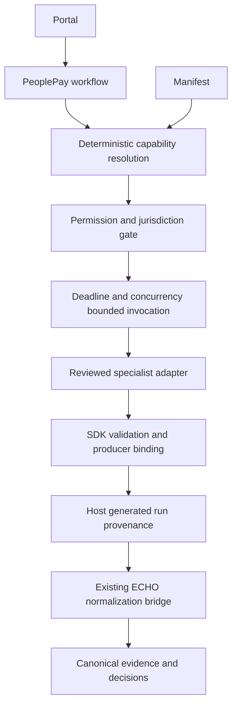
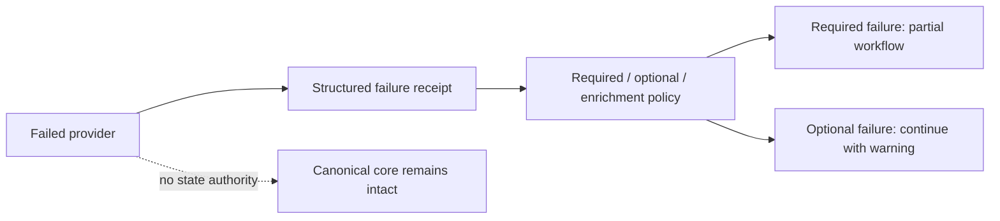

# Extension Runtime

The SDK remains `peoplepay_sdk` API v1. Additive fields accept dotted capability
IDs while preserving legacy names. Runtime manifests map stable contracts to
existing provider capability names. `journey/runtime_manifest.py` validates
host-owned `extensions/*/runtime.yaml`; strings never execute imports.

Registry records capabilities, jurisdiction, enabled state, priority, fallback
rank, runtime mode, upstream/license reference and readiness. Missing adapters
are unavailable. Bad manifests report `INVALID_CONFIGURATION`. Disable with
`PEOPLEPAY_DISABLED_EXTENSIONS=civicmesh,greenchain`; restart configured services.
`set_enabled()` supports process-local toggles; no public arbitrary mutation API.

Both HTTP-backed and local SDK providers implement the same protocol. Current
HTTP providers use existing origin-validated `HttpSourceClient` adapters.
Manifest endpoint environment names are configuration references, not URLs
accepted from callers. CLI/container/unreviewed remote loading is unsupported.

Invocation revalidates requests, allowlists input and constraint fields,
withholds actor/tenant and transaction references unless granted, validates
health identity and capability health, checks result producer/version/request,
and stamps run/workflow/runtime/time provenance. Optional degraded components
need not disable healthy deterministic capabilities. Malformed results never
reach the caller as accepted receipts. Exceptions contain sanitized codes.

One wall-clock budget covers queueing, health and fallback attempts; each
provider additionally has a manifest timeout. Per-runtime concurrency counts
are bounded. Cancellation propagates and releases slots. Retries are not
automatic; each fallback failure retains a separate trace. Parallel independent
steps use `asyncio.gather`. Provider proposals always require human approval.

The retained ECHO extension API has its existing graph proposal permissions,
circuits, transport and ingestion transaction machinery. It remains a legacy
compatibility path, rather than a second public SDK. Startup isolates malformed
optional ECHO manifests; strict loader mode remains available to contract tests.

Permissions protect contract boundaries. Local Python adapters are reviewed
trusted code, **not OS-sandboxed hostile plugins**. No arbitrary filesystem,
subprocess, transaction authorization, payment execution, approval modification
or canonical DB write capability is granted. Process isolation for adversarial
local code remains required before third-party executable loading is safe.

Authenticated APIs: `GET /api/v1/extensions`, `GET /api/v1/capabilities`,
`POST /api/v1/capabilities/resolve` with `{capability,jurisdiction}`.
Catalog responses omit retained invocation IDs to avoid cross-actor disclosure.
`/extensions` renders configuration with text nodes and labels experimental status.

To add a provider: audit its repository and license; implement the existing SDK
protocol; add a runtime manifest with exact scopes; explicitly attach reviewed
code in `journey/bootstrap.py`; add producer, permissions, jurisdiction, timeout
and malformed-output tests. Adding an invocation provider does not require ECHO
changes. Adding a new canonical domain currently still needs an ECHO translator
and reviewed policy; see the unresolved work in the integration report.
