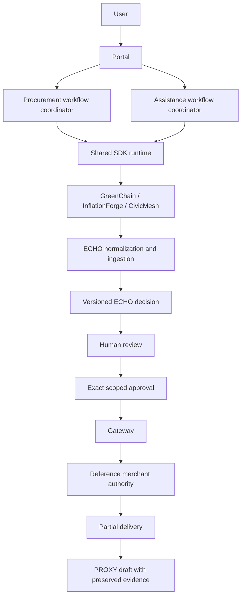
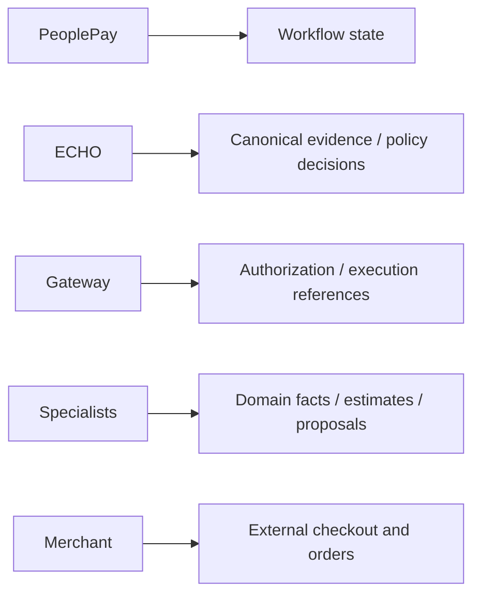

# Unified journeys

Procurement `/journey` now invokes GreenChain and InflationForge through the
shared SDK runtime. Assistance `/assistance` uses the same gate for CivicMesh.
Existing ECHO translation, canonical decisions, approval checks, reference
merchant state and PROXY evidence handoff remain in their service owners.

Browser verification used live local ECHO/FalkorDB and Gateway, the explicitly
simulated procurement reference data/merchant/PROXY draft, and the real local
CivicMesh deterministic service. The 300-chair order was approved in the UI;
260 delivered produced a linked 40-chair discrepancy draft without copying IDs.
Medical-bill assistance produced options and a missing-information question;
it performed no payment. The provider page worked at 390px with no horizontal
overflow or console errors. Captures are under ignored `output/playwright/`.

Rumi selection-to-procurement, InHeir-to-ECHO property workflows, generic Beacon
operations proposals, and a general SDK PROXY provider remain incomplete.
Their specialist projects and existing APIs/adapters remain preserved. The
generic workflow engine is experimental and not yet the single orchestration
engine behind these existing domain journeys.
