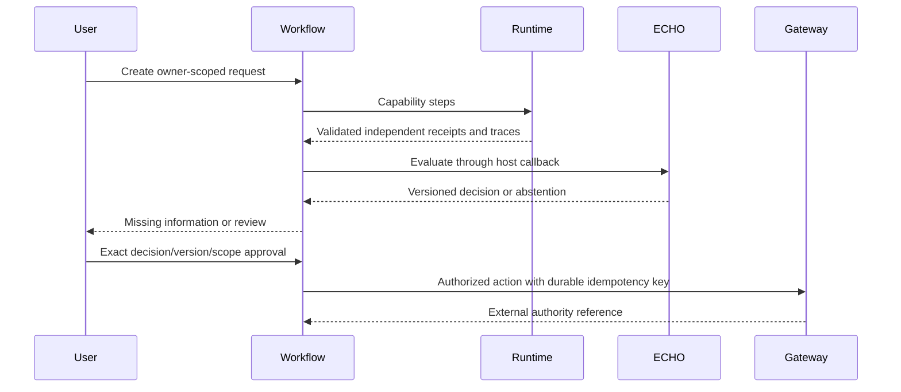

# Workflow Engine v1

`journey/workflow.py` implements a small reusable capability-step engine using
the existing SQLite `JourneyStore`. Each snapshot is owner-scoped and protected
by optimistic revision checks. Runtime capability steps can be required,
optional or enrichment. Independent steps run concurrently.

States: CREATED, DISCOVERING, WAITING_FOR_INFORMATION, EVALUATING,
REVIEW_REQUIRED, WAITING_FOR_APPROVAL, AUTHORIZED, EXECUTING, COMPLETED, PARTIAL,
FAILED, CANCELED. An unavailable required capability produces PARTIAL. Missing
or failing ECHO evaluation produces REVIEW_REQUIRED and never authorization.

Input updates preserve the workflow and decision history, clear approval and
require reevaluation. Approvals bind actor, decision identity/version and a hash
of action scope. Event IDs prevent duplicate evaluation/approval and reject
different payloads under a reused ID. Execution persists EXECUTING before the
external call; a retry uses the same durable key. Gateway callbacks must
independently validate authority and implement durable external idempotency.
Cancellation cannot pretend to cancel a completed external action.

APIs use existing Gateway caller authentication and rate limiting:

| Method | Path | Body |
|---|---|---|
| POST | `/api/v1/workflows` | intent, jurisdiction, steps |
| GET | `/api/v1/workflows` | Owner-scoped list |
| GET | `/api/v1/workflows/{id}` | Snapshot |
| GET | `/api/v1/workflows/{id}/timeline` | Versioned events |
| POST | `/api/v1/workflows/{id}/run` | event_id |
| POST | `/api/v1/workflows/{id}/input` | step_index, values, event_id |
| POST | `/api/v1/workflows/{id}/approve` | decision_id, version, scope_hash, event_id |
| POST | `/api/v1/workflows/{id}/cancel` | event_id |

The generic HTTP engine intentionally has no evaluator/executor attached yet;
it offers invocation and review, not arbitrary spending. Existing procurement
and assistance retain their fully domain-specific ECHO policies and stores.
Migrating those coordinators onto this generic state engine, without duplicating
their canonical state, remains outstanding. Process locks do not establish
distributed exactly-once execution or a durable event outbox.
