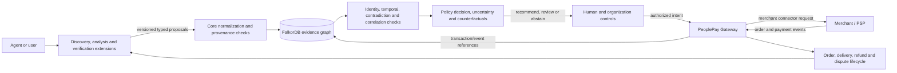

# PeoplePay ECHO: canonical trust and provenance layer

ECHO is the evidence and decision service for PeoplePay's agentic commerce
journey. An agent, a specialist product, or a person may propose a supplier,
price, risk assessment, or other claim. ECHO validates the proposal, preserves
its source and producer lineage, checks it against existing evidence and
policy, and explains the resulting recommendation or abstention.

**Extensions collect intelligence. ECHO evaluates trust and decisions.
PeoplePay mediates consequential actions.** The merchant/payment provider stays
authoritative for its own inventory, checkout, payments, and order status.
PeoplePay records authorized requests and verified references/events. ECHO
stores the evidence lineage and decision rationale that led to those requests.

## Current service boundary

- `echo/` contains the FastAPI service, static UI, core evidence engine,
  extension registry/runtime/transport, graph ingestion, and approval adapter.
- `extensions/*/extension.yaml` contains validated extension declarations.
  Core bootstrap attaches only explicitly reviewed in-process adapters.
- `compose.echo.yaml` runs FalkorDB on loopback port 16380 with a persistent
  named volume. The ECHO API is started separately on loopback port 8090.
- The ECHO graph is `peoplepay_echo`; the PeoplePay Gateway keeps its own
  transaction database. Approval stores references and state for the draft
  handoff rather than replacing the gateway transaction record.
- The ECHO browser has a false-consensus fixture and a two-provider synthetic
  integration fixture. They use invented `.example` data and do not contact
  live suppliers.

When `BEACON_GATEWAY_SECRET` is set, ECHO derives caller identity from the
Gateway's signed bearer token. Without it, the local demo trusts
`X-Beacon-User`; this fallback is not production SSO or tenant isolation.
`ECHO_ADMIN_TOKEN` protects extension toggles in local mode. See the
[security boundary](extensions/security.md) and [local run guide](DEMO.md).

## Extension flow

1. The caller binds the request to a requirement it owns and selects a
   capability or a named reviewed provider.
2. The registry checks enabled state, adapter availability, dependencies,
   declared permissions, service configuration, and health.
3. The runtime applies bounded typed envelopes, provider-specific concurrency,
   deadlines, circuit state, safe errors, secret checks, and fallback policy.
4. The adapter returns proposals. It cannot issue graph queries or alter
   decision policy. Service mode uses fixed reviewed methods/paths and bounded
   JSON over the configured allowlisted endpoint.
5. Core ingestion checks producer/version, request ownership, required source
   metadata, identifiers, dependency cycles, duplicate conflicts, and graph
   permissions before writing one idempotency event and its records.
6. The engine traverses the current candidate evidence paths, resolves
   explicit source dependencies, applies freshness/identity/provenance gates,
   and stores a candidate-specific decision snapshot.
7. A human-confirmed non-demo recommendation is reevaluated before ECHO asks
   the Gateway to create a draft transaction and planning record. ECHO never
   executes checkout or charges a payment method.

## Trust and graph semantics

The graph holds `Requirement`, `CandidatePolicy`, `Supplier`,
`EntityRepresentation`, `Claim`, `Evidence`, `Source`, `SourceSnapshot`,
`Extension`, `ExtensionVersion`, `ExtensionRun`, `Observation`, `Decision`,
`DecisionCandidate`, `Approval`, and linked transaction references. Edges
record source derivation/citation/mirroring, claim support/contradiction,
producer observation, entity resolution, policy eligibility, decision use,
human review, and gateway handoff.

ECHO only treats explicitly recorded source-dependency paths as shared roots.
Missing, cyclic, unknown, stale, future-dated, or otherwise unresolved paths
can block a recommendation. Exact domain identifiers may connect
representations, but they do not prove domain ownership. Text or names alone
remain unresolved. A root count is recorded provenance diversity; it does not
prove truth or statistical independence.

Core decisions are recomputed from current graph state and saved with the
candidate evidence/policy snapshot used. Reassessment creates a new decision
linked to its parent. Approval compares the current recommendation with that
snapshot before proceeding, and an uncertain remote create enters
reconciliation-required state instead of blindly creating another draft.

## Cross-project capability status

| Capability | Current status |
|---|---|
| Synthetic source discovery and cross-provider ingestion | Implemented for deterministic first-party demos. |
| InflationForge price observations | Narrow read-only adapter implemented; disabled by default; USD city basket observations are not merchant quotes. |
| GreenChain, PROXY, Rumi adapters | Deferred manifests and intake/licensing records only; no executable ECHO adapters. |
| Beacon, InHeir | Separate services exposed through the PeoplePay directory, with no default authority in ECHO decisions. |
| Merchant ACP or equivalent connector | Not implemented. The [Agentic Checkout Spec](https://developers.openai.com/commerce/specs/checkout) is a relevant merchant-session, completion, and lifecycle-event reference, not a deployed PeoplePay integration. |
| Live payment, refund, and fulfillment | Not implemented in PeoplePay checkout. The Gateway `/checkout` remains unavailable; local sandbox orders move no money. |
| Organization policy, SSO, multi-worker coordination | Roadmap. Current fallback identity, extension toggles, and approval serialization are local/process scoped. |

## Decision policy and measurements

The demo applies `clamp(raw - 3 × max(0, active_observations - roots) - 20 × (1 - mean_confidence), 0, 100)` and requires at least two provenance roots. The fixture is useful for explaining correlation penalties and abstention, not for supplier ranking claims. The 15 synthetic graph benchmark cases report their precise edits and local runtimes in [`extensions/benchmark-results.json`](extensions/benchmark-results.json); they do not measure live supplier precision or production throughput.

## Next engineering milestone

Build **PeoplePay Extension SDK v1** around the current versioned contract:
Python schemas, a remote-service scaffold, manifest linting, health/error
conventions, conformance tests, and an example provider. New open-source tools
should run behind a reviewed service boundary and submit normalized proposals.
ECHO's graph and decision internals should not change for a new adapter unless
the core contract itself is intentionally versioned. The full milestone and
capability rollout order are in [the product plan](unified-product-plan.md).

## Assistance policy evidence

CivicMesh contributes Program entities, eligibility inference claims and uncalibrated score estimates. Provider-scoped rule IDs resolve Program identity; display names do not establish cross-provider identity. ECHO persists immutable decision snapshots and USED_CLAIM provenance. Policy version, evaluation date, native policy context and rule data are preserved. Bundled source URLs remain PROVENANCE_UNKNOWN and require review. Gateway assistance never issues AuthorizedAction or moves money. [Authority matrix](architecture/SOURCE_OF_TRUTH_MATRIX.md).
