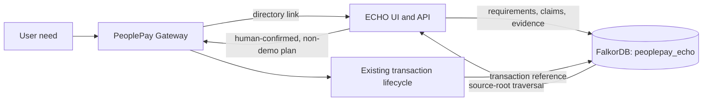

# PeoplePay ECHO architecture

ECHO is an evidence service in the PeoplePay product suite. It does not replace
the PeoplePay transaction aggregate or gateway. The gateway remains the
transaction owner; ECHO records evidence lineage and recommendation provenance
in its own graph.

## Graph vocabulary

Nodes include `User`, `Requirement`, `Product`, `Supplier`, `Claim`, `Evidence`,
`Agent`, `AgentRun`, `Source`, `SourceSnapshot`, `Decision`,
`DecisionCandidate`, `Approval`, `Transaction`, `Order`, `DeliveryEvent`, and
`Dispute`. Relationships capture creation, source observation, claim support,
agent production, source dependency, supplier offer, decision use, review, and
downstream transaction lineage.

The current candidate ranking query follows evidence → source → terminal source
root with explicit `DERIVED_FROM`, `CITES`, and `MIRRORS` links, up to eight
edges. The demo marks Alpha's copied pages as children of one root, so its eight
observations count as one root. Beta's three sources have no dependency edges,
so each is a root. In real data, missing dependency links will result in roots
being counted separately; ECHO does not yet discover hidden relationships.

## Decision rule

`robust = clamp(raw - 3 × max(0, active_observations - roots) - 20 × (1 - mean_confidence), 0, 100)`

The weights, source graph, and raw scores are demo policy inputs. Confidence is
a field supplied with evidence, not a calibrated probability. At least two
roots are required for a recommendation. If no candidate meets this minimum,
ECHO abstains. Root-removal scenarios are recomputed from the query's evidence
paths and are shown as sensitivity analysis, not statistical estimates.

## Handoff and trust boundary

`POST /echo/decisions/{id}/approve` rejects missing human confirmation,
non-recommendations, demo decisions, missing owner match, and requirements
without a budget. It then calls the existing gateway to create a transaction
and planning record. It does not make a booking or payment. ECHO's API currently
has no authentication; user IDs are fields, not verified identities. A
production handoff must add authenticated tenant identity and durable event or
transaction-reference handling before wider deployment.

FalkorDB is started locally by `compose.echo.yaml` and bound only to loopback on
port 16380. The FastAPI service is currently started in an isolated local
Python environment, also on loopback. See [the operator/demo guide](DEMO.md).
