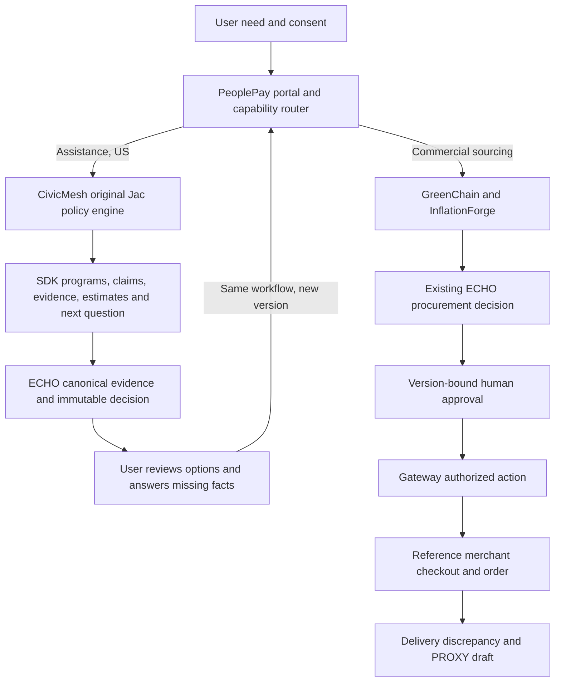

# CivicMesh integration and error remediation report

Verified locally on 2026-10-06. This is a real deterministic service-to-SDK-to-ECHO handoff, with a preserved specialist application. Procurement, merchant and dispute demonstrations retain their explicitly labeled reference boundaries.

## Preservation and project inventory

1. **Baseline commit:** `53e22eebceb7e194fb3769eff4a3d10979fca4e5`.
2. **Tracked files before:** 1,987. The older zero-deletion baseline contains 1,945 paths.
3. **Tracked files after:** **2,202**; 215 additions, 75 modifications, zero deletions in this delivery.
4. **Zero deletion:** no baseline paths missing. All 167 originally supplied CivicMesh files match their recorded SHA-256 bytes. An additive CivicMesh interpreter setting is separate from the original snapshot. `.gitattributes` prevents cross-platform newline conversion of that snapshot.
5. **Projects:** PeoplePay portal/coordinator, Gateway/transaction, ECHO/FalkorDB, Extension SDK, GreenChain sourcing, InflationForge price context, CivicMesh assistance policy, PROXY disputes, Rumi room/product discovery, InHeir property/legal workflows, Beacon operations. See the [current matrix](../SYSTEM_CATALOG.md).
6. **Technical map:** [native files and functions](CIVICMESH_TECHNICAL_MAP.md). The adapter directly imports the supplied Jac deterministic functions; no ejected or copied policy engine exists.
7. **Upstream:** declared `Anbu-00001/CivicMesh`, MIT copyright 2026 Anbu. The supplied archive has no upstream Git commit metadata; commit identity is unknown. [Ownership record](CIVICMESH_UPSTREAM.md).

## Implemented handoff

8. **Adapter:** `extensions/civicmesh/adapter.py`, isolated native HTTP service in `service.py`, optional existing ECHO extension-runtime bridge in `echo_adapter.py`.
9. **Manifest:** `extensions/civicmesh/extension.yaml`, reviewed service origin/credential, capability and graph permissions; disabled by default in ECHO's general registry. The assistance coordinator explicitly registers its reviewed provider when configured.
10. **SDK:** public SDK v1 contracts remain compatible. Program entities carry claim/estimate attributes; bounded `raw_result` carries policy, next question, routes and producer trace. Existing `ActionProposal` and `PeoplePayEvent` contracts are reused.
11. **Runtime:** explicit SDK registry registration, capability/jurisdiction selection, field permission check, health, shared invocation timeout, schema and receipt binding, sanitized failure, bounded telemetry. Manifest strings never load executable code.
12. **Request:** controlled need, ISO country, language, voluntary structured age/income/household/location/status facts and explicit consent. The service additionally receives workflow/request IDs. Original conversation, actor identity, payment account and unrelated context are not sent.
13. **Result:** native programs, eligibility criteria/rule definitions, benefit context, heuristic scores, policy version/effective date, bundled source references, plan, next question, routes and fingerprint. Scores are uncalibrated; bundled URLs are not live verification.
14. **ECHO:** normalize -> permission-checked canonical Program/Claim/Evidence/Source/ExtensionRun nodes -> versioned Decision -> `USED_CLAIM` edges. Historical snapshots retain normalized output and receipt. Input/version ownership, input digest, snapshot digest and idempotent retry are checked. A graph failure leaves the coordinator's pending receipt available for retry.
15. **Portal:** `/assistance` shares PeoplePay navigation, styling, actor and browser-tab authorization context. It supports options, structured follow-up in the same workflow, saved URLs, retry and readable historical explanation. `/journey` preserves procurement approval/order/delivery/PROXY flow.
16. **Privacy:** explicit consent, minimal structured facts, dedicated provider token, allowlisted CivicMesh child environment, 16 KiB service-body limit, bounded response envelope, per-workflow throttle and bounded throttle registry. SQLite and ECHO retain relevant facts/evidence; no cross-service erasure or production retention promise is made.
17. **Jurisdiction:** CivicMesh covers US policy only. IN/GB assistance requests show unsupported coverage without invoking a substitute. PeoplePay intent routing currently uses English patterns. Crisis cues take priority over commercial keywords; routing is conservative and does not constitute a clinical assessment.



## Verification

18. **Executed checks:** separate native environments; tests, frontend lint/type checking, Beacon build, Python lint/type checking, preservation, LFS, Compose configuration, browser scenarios and local failure injection. Exact commands are below and in the [remediation ledger](../error-remediation-2026-10-06.md).
19. **CivicMesh:** 39 Python service/guard tests passed. Original Jac evaluation: 439 cases; 1,009/1,009 fields, 54/54 top-three checks, 73/73 language routing checks, 228/228 metamorphic checks, zero exclusion errors. Additional original message catalogs (50 languages), 19 hostile input checks, 66 privacy checks and 69 policy-date checks passed. The privacy test explicitly reports five known scrubber-miss forms; this adapter avoids forwarding original text, but native scrubbing is not complete. The native specialist graph/model/UI suites have not all been run.
20. **PeoplePay:** 393 root/SDK integration tests passed with graph/native capture required. Beacon 451, GreenChain 54, InflationForge 22, PROXY 65, Rumi 438, InHeir regression subset 15. Total with ECHO and CivicMesh Python checks: **1,616 passing tests**, excluding the separate 439 native evaluation cases. No full-suite skips are counted as passes.
21. **ECHO:** 139 tests passed against real local FalkorDB. New assistance tests prove graph links, historical versions, actor isolation, unapproved manual bill comparison, malformed-receipt refusal before mutation, version-marker recovery and corrupted-snapshot refusal.
22. **Browser:** eviction request -> six program options -> TX answer -> same workflow version 2 -> both historical decisions. Medical bill -> six assistance alternatives plus an unverified USD 1,000 manual bill option. Office chairs -> procurement link. Procurement -> Supplier B approval -> checkout/order -> 260/300 delivered -> automatic 40-chair dispute draft -> preserved version-1 explanation. Fresh browser console: zero errors/warnings. Mobile 390 px layout inspected.
23. **LFS:** `git lfs fsck` passes. Recovered original corpora remain tracked; no generated Jac cache, virtual environment, browser artifact or credential file is published.
24. **Performance:** ten warm local HTTP evaluations and 100 normalization samples, measured by `scripts/benchmark_assistance.py`:

| Stage | Samples | Median ms | p95 ms |
|---|---:|---:|---:|
| Native output -> SDK envelope | 100 | 1.274 | 3.368 |
| SDK -> ECHO proposals | 100 | 2.939 | 5.383 |
| Native engine in live service | 10 | 44.622 | 59.358 |
| Provider health + HTTP + SDK | 10 | 659.580 | 689.097 |
| ECHO request, including graph ingestion/decision | 10 | 91.410 | 127.393 |
| Complete portal API request | 10 | 792.060 | 861.277 |

The provider figure includes transport/client setup and native computation; it is not a pure adapter overhead measurement. ECHO timing includes HTTP and snapshot work, not just graph writes. Latest native 439-case run under concurrent validation: median 62.16 ms, p95 118.68 ms. These local samples are not throughput or production SLA claims. Each assistance evaluation produced six Program options and twelve Claims.

### Recovery and errors corrected

- Stopping only CivicMesh leaves ECHO/Gateway and procurement available. The saved workflow reports `ASSISTANCE_PROVIDER_UNAVAILABLE`, retains its previous decision, and recovers after service restart with a new version.
- ECHO failures retain the exact pending provider receipt; retry does not silently change that receipt. The real graph tests cover committed-decision/version-marker recovery.
- Gateway malformed-body rejection previously intermittently reset Windows clients. Its bounded close path now sends/flushed the response, half-closes writes and briefly drains remaining input; reused-connection regressions and the full root suite passed.
- Repaired native InflationForge collection/type narrowing; GreenChain backend and training-tool typing; PROXY/Beacon lint setup and hook warnings; InHeir client request/map lifecycle plus storage, RAG, Azure configuration, JWT/password handling.
- Static checks: root/ECHO/SDK/adapter/launcher/benchmark mypy covers 74 files, GreenChain backend 20 and separate ML tools 10, InflationForge 26; Ruff and Gateway JavaScript syntax checks pass. PROXY and InHeir frontends pass type check/lint; Beacon passes lint/type check/Vite build; GreenChain and Rumi pass type check/lint.
- Specialist agents contributed earlier repairs. Further agent runs failed due revoked authentication/usage limits. The primary agent completed the final hostile review and validation; no independent completed final review is claimed.

## Limitations and operating commands

25. **Remaining limits:** CivicMesh bundled policies and capacity estimates require source/local availability review; no live benefits application, certification or payment occurs. Native EN/ES deterministic messages are covered; other language enrichment, graph visitor sessions and specialist UI federation remain separate. Follow-up collects only the allowlisted facts; unsupported native questions explicitly direct the user to native intake/program support. Native income questions ask monthly income, while this portal explicitly accepts annual USD amounts and labels the conversion. Rumi/InHeir do not yet have complete SDK journeys or shared hosted SSO. Merchant/PROXY reference mode remains simulation. Native Azure/Mongo/Clerk/Convex/LLM services and production deployment are unverified. Distributed ECHO version coordination, retention/erasure, durable external event transport and enterprise approval chains remain work. Local OPEN actor mode is for development only. Dependency deprecation/metrics warnings remain documented; the shared global Python environment is unsupported.
26. **Install/run locally** from the repository root using Python 3.12:

```powershell
python -m venv .venv-journey-review
.\.venv-journey-review\Scripts\python.exe -m pip install -r requirements-journey-dev.txt
python -m venv .venv-echo
.\.venv-echo\Scripts\python.exe -m pip install -r echo/requirements-dev.txt
python -m venv .venv-civicmesh
.\.venv-civicmesh\Scripts\python.exe -m pip install -r extensions/civicmesh/requirements.txt
docker compose -f compose.echo.yaml up -d falkordb
```

27. **Core:** `python scripts/dev_peoplepay.py`.
28. **Assistance:** `python scripts/dev_peoplepay.py --assistance`.
29. **All integrated services:** `python scripts/dev_peoplepay.py --all`. This starts Gateway, ECHO and CivicMesh; it does not start every specialist frontend, install dependencies or deploy cloud services. Default ports 8080/8090/8092. The current reviewed preview uses `--gateway-port 8180 --echo-port 8190`, with separate preview SQLite databases and the preserved ECHO preview graph.
30. **Exact integration level:** CivicMesh **Level 3: real typed capability handoff**, with local versioned follow-up/history/events. Procurement has its separate automatic reference lifecycle through PROXY. This report does not claim complete full-workflow federation for every bundled project or completion of all long-term mission phases.

```powershell
$env:REQUIRE_JOURNEY_GRAPH='1'; $env:REQUIRE_NATIVE_CAPTURE='1'
.\.venv-journey-review\Scripts\python.exe -m pytest -q
.\.venv-echo\Scripts\python.exe -m pytest -q echo/tests
$env:PYTHONUTF8='1'
.\.venv-civicmesh\Scripts\python.exe -m pytest -q extensions/civicmesh/tests CivicMesh-main/civicmesh/tests/test_cmguard.py
# In CivicMesh-main/civicmesh:
..\..\.venv-civicmesh\Scripts\jac.exe run tests/eval_engine.jac
# Back in the repository root:
.\.venv-journey-review\Scripts\python.exe scripts/benchmark_assistance.py --url http://127.0.0.1:8180
python scripts/verify_zero_deletion.py
python scripts/verify_civicmesh_preservation.py
git lfs fsck
```

## Container verification and publication scope

The isolated Linux image built successfully. Its HTTP health/evaluation smoke check returned six native programs; 39 boundary/guard tests and the full 439-case native evaluator passed inside the container. The native fingerprint matched the supplied Windows source snapshot. Container evaluator median 35.63 ms, p95 42.77 ms. This is a local image check, not a production deployment.

This machine's package-download proxy certificate is absent from the base image trust store. The build was completed using the host's trusted public CA bundle through an optional BuildKit secret, with TLS verification enabled. The trust bundle and host `.env` are absent from the final image. Normal environments can build the Compose profile directly; proxied environments can use an operator-approved trust bundle:

```powershell
docker build --secret id=peoplepay_build_ca,src=C:/path/to/trusted-ca-bundle.pem -f extensions/civicmesh/Dockerfile -t paymentatcriticalsituation-civicmesh .
```

The Dockerfile-specific ignore file includes only adapter/native source and excludes credentials, virtual environments and generated caches. Source, tests, docs, original CivicMesh files and the additive interpreter setting are included in the PeoplePay publication scope. LFS/preservation checks and staged secret-signature review passed. The hosted GitHub Actions result is separate from local validation. Browser and benchmark artifacts remain local in ignored `output/`.
