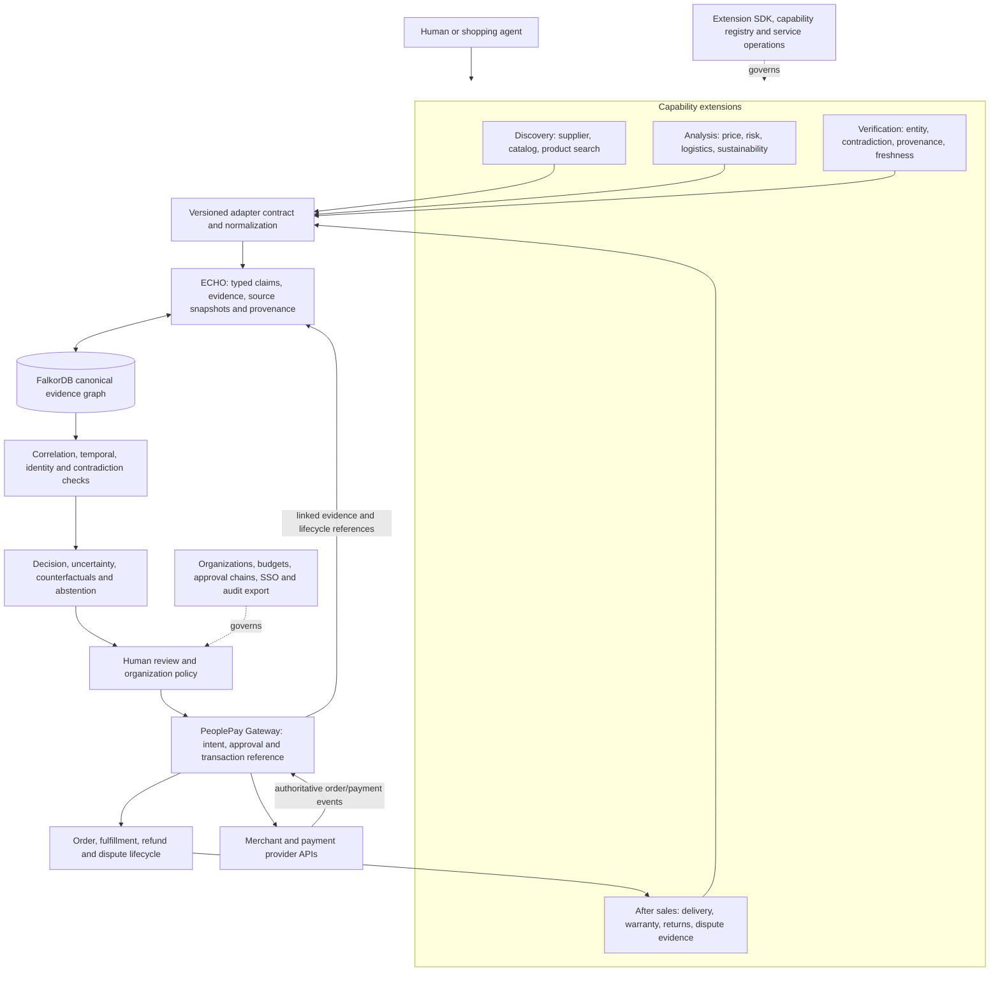

# PeoplePay: an evidence-aware transaction operating system for AI agents

PeoplePay brings specialist discovery, analysis, verification, decision, and
transaction capabilities into one product journey. **ECHO is the canonical
trust, provenance, and decision layer.** Extensions collect and normalize
intelligence; ECHO evaluates the evidence; PeoplePay applies user and business
policy before consequential actions.

## Product architecture

The policy boundary is deliberate: extensions submit evidence proposals, ECHO
judges what the graph and policy support, and PeoplePay mediates user-authorized
actions. A merchant and its payment service provider remain authoritative for
their order and payment records. PeoplePay should store their identifiers and
verified lifecycle events, not claim authority over a merchant's backend.

OpenAI's Agentic Commerce Protocol is a useful commerce integration reference:
agents create, update, and complete merchant checkout sessions, while the
merchant validates the cart, uses its payment rails, and sends order lifecycle
events. PeoplePay can adopt the same separation when it builds merchant
connectors; ACP is not a replacement for ECHO's evidence contract or the
PeoplePay internal transaction model. See the [Agentic Checkout Spec](https://developers.openai.com/commerce/specs/checkout)
and [Agentic Commerce key concepts](https://developers.openai.com/commerce/guides/key-concepts).

## Where the bundled projects fit

| Project | Capability role | Current integration state |
|---|---|---|
| PeoplePay Gateway | Product entry, intent, user approvals, transaction and sandbox order lifecycle | Existing gateway remains separate. Live `/checkout` is unavailable and sandbox orders move no money. |
| ECHO | Canonical claims, evidence, provenance graph, decision traces and controlled approvals | Implemented as a separate FastAPI/FalkorDB service; extension manifest/runtime/API and two synthetic source providers are available. |
| InflationForge | Regional price intelligence | A narrow read-only, disabled-by-default adapter is implemented. Its observations are not merchant quotes. |
| GreenChain | Supplier and sourcing discovery, sustainability estimates | Intake and deferred manifest only. README claims MIT, but the bundled tree has no LICENSE file; source/data/model redistribution rights need resolution. |
| PROXY | After-sales dispute evidence and draft preparation | Deferred manifest and intake only. No executable ECHO adapter; upstream license and API/authorship boundaries need review. |
| Rumi | Product/room planning and furniture discovery | Deferred manifest and intake only. No executable ECHO adapter or verified external-search handoff. |
| Beacon | Platform health, incidents, and operator actions | Existing separate service and gateway directory entry; not a trust decision authority. |
| InHeir.AI | Property and legal vertical workflows | Existing separate service and gateway directory entry; not inserted into procurement decisions by default. |

The suite directory is one entry point, not shared authentication, shared
storage, or proof that every module is deployed. See the [bundled project
intake](extensions/intake/bundled-projects.md) for evidence, licensing, and
activation gates.

## Capability layers and build order

1. **Evidence acquisition:** supplier discovery, catalog/search feeds,
   document parsers, and web extraction. Every result includes source address,
   retrieval time, scope, and capture metadata where actually available.
2. **Evidence intelligence:** canonical entity resolution, claim conflicts,
   provenance/root analysis, freshness, and uncertainty. Exact identifiers can
   support links; names or matching domains alone do not certify ownership.
3. **Decision intelligence:** transparent multi-objective policy, supplier
   ranking, fragility/counterfactual analysis, and abstention. External scores
   are inputs with provenance, not authority.
4. **Commerce:** merchant-specific catalog, checkout, payment, order, and
   cancellation connectors. Keep merchant pricing/inventory and order/payment
   outcomes authoritative at the merchant/PSP. Require signed requests,
   idempotency, safe retry/reconciliation, and explicit user authorization.
5. **After sales:** delivery evidence, warranties, returns, refunds, and
   dispute preparation. PROXY can help organize a draft; a human approves
   submissions and the merchant remains authoritative for resolution.
6. **Enterprise:** organization identity, tenant isolation, budgets, policies,
   approval chains, SSO, and audit exports.
7. **Developer platform:** Extension SDK, manifests, capability/version
   registry, permission model, API credentials, conformance tests, and
   observability.

Verticals such as procurement, B2B buying, travel, insurance, property,
healthcare purchasing, subscriptions, vendor approval, and contract renewals
can reuse these layers. They need domain-specific evidence and policies; a
shared runtime does not make their decisions interchangeable.

## Next milestone: PeoplePay Extension SDK v1

Make a reviewed external service the default integration shape so adding an
open-source project does not require importing its code into ECHO or changing
ECHO's decision internals. Keep in-process adapters limited to reviewed
first-party code. SDK v1 should provide:

- Python reference package and versioned request/result types matching ECHO's
  v1 envelope and manifest contract.
- A reference HTTP service scaffold with health/readiness endpoints, bounded
  request/response sizes, fixed capability routes, and structured safe errors.
- Manifest linting for capabilities, versions, permissions, secrets, source
  requirements, dependency ordering, and unsupported operations.
- Test utilities and conformance cases for provenance retention, idempotency,
  cancellation/timeouts, malformed output, secret redaction, and disabled
  service behavior.
- One tutorial adapter using synthetic fixtures plus an adapter intake
  worksheet for license, upstream identity/commit, data/model rights, API,
  auth, egress, state, failure modes, and maintenance evidence.
- A repeatable build, package inventory, and contribution/release checklist.

The ECHO core keeps sole ownership of graph writes, entity/claim policy,
scoring, approval, and transaction lineage. The SDK produces proposals and
conformance evidence. The registry/operator decides which reviewed service is
available; a manifest cannot execute arbitrary code or grant itself authority.

## Release boundary

The current checkout proves local graph evaluation, extension boundaries,
synthetic cross-extension ingestion, and a planning handoff. It does not prove
live supplier accuracy, hidden-copy detection, production identity, multi-
worker approval safety, or live merchant checkout. Build these in layers and
keep each readiness claim tied to its tests and actual provider environment.
